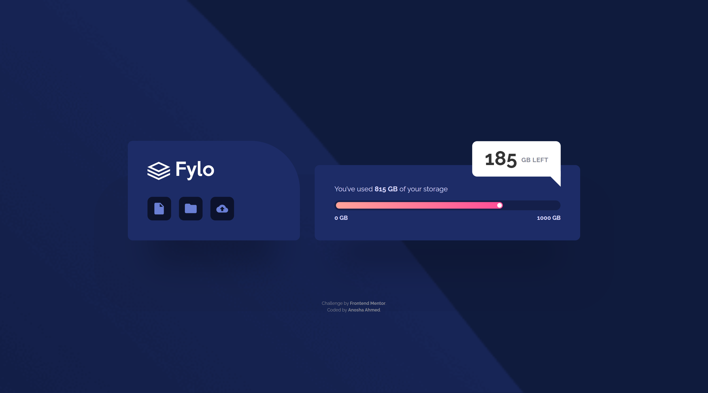
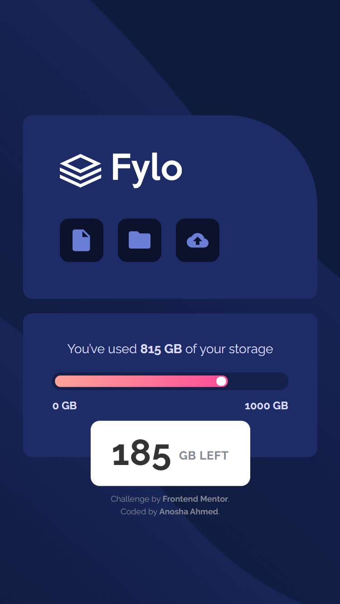

# Frontend Mentor - Fylo data storage component solution

This is a solution to the [Fylo data storage component challenge on Frontend Mentor](https://www.frontendmentor.io/challenges/fylo-data-storage-component-1dZPRbV5n).

## Table of contents

- [Overview](#overview)
  - [The challenge](#the-challenge)
  - [Screenshot](#screenshot)
  - [Links](#links)
- [My process](#my-process)
  - [Built with](#built-with)
  - [What I learned](#what-i-learned)
  - [Continued development](#continued-development)
  - [Useful resources](#useful-resources)
- [Author](#author)
- [Acknowledgments](#acknowledgments)

## Overview

### The challenge

Users should be able to:

- View the optimal layout for the site depending on their device's screen size

### Screenshot

<div align="center">
The desktop design VS My desktop solution<br>
<a href="challenge/desktop-design.jpg" target="_blank"></a> <a href="solution-screenshots/desktop-preview.png" target="_blank"></a>
</div>

<br>

<div align="center">
The mobile design VS My mobile solution<br>
<a href="challenge/mobile-design.jpg" target="_blank"></a> <a href="solution-screenshots/desktop-preview.png" target="_blank"></a>
</div>

### Links

- Solution URL: [FrontEnd Mentor: My Solution](https://www.frontendmentor.io/solutions/fylo-data-storage-component-flexbox-mobilefirst-responsive-LeY1jA7DW)
- Live Site URL: [GitHub Page: Fem Fylo Component](https://github.com/anoshaahmed/fem11-fylo-component/)

## My process

### Built with

- Semantic HTML5 markup
- CSS custom properties
- Flexbox
- Mobile-first workflow

### What I learned

I learned to:
- make a progress bar
- use `clip-path ` property
- put icons in a list
- add a "hidden-title" because I needed an `<h1>` on my page for accessibility purposes, but the page didn't require one, so I added one in my code that wouldn't visibly show on the webpage, but would to a screen reader
- use the `::after` property to create a shadow/reflection
```css
main {
    flex-direction: row;
    gap: 1.9rem;
    align-items: flex-end;
    padding-bottom: 1.5rem;
    border-radius: 50px;
}

main::after {
    content: "";
    position: absolute;
    z-index: -1;
    height: 123%;
    width: 115%;
    background-color: hsla(229, 57%, 11%, 0.07);
    bottom: -120px;
    border-radius: 90px;
}
```

### Continued development

If I ever make a progress bar again, I want to do it properly. Next time I also aim to have more structure to my CSS.

## Author

- Website - [Anosha Ahmed](https://www.anoshaahmed.com)
- Frontend Mentor - [@anoshaahmed](https://www.frontendmentor.io/profile/anoshaahmed)
- Twitter - [@anosha1ahmed](https://www.twitter.com/anosha1ahmed)

## Acknowledgments

Shoutout to @elroytoscano for his advices on my Frontend Mentor solutions to help me advance my coding skills. It really helps.
